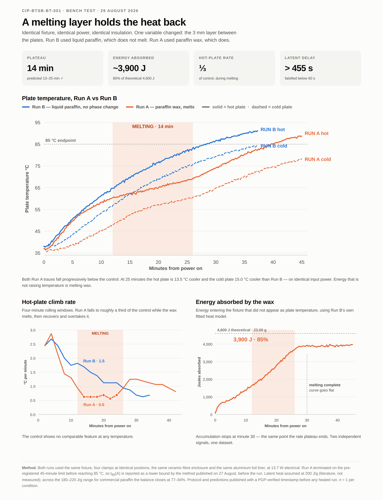

# BTSB Bench Test — Pre-Registration and Results

**CIP-BTSB-BT-001** · CIP — Compute Infrastructure Platform
S. Mohammed Idreesh · Chennai, India

A bench-scale test of the phase-change buffering mechanism used in
Layer 2 of the BTSB inter-cell safety pad.

The protocol, predictions, analysis methods and falsification criteria
were committed **26 August 2026, 06:38:48 IST (2026-08-26T01:08:48Z)**,
PGP-verified, **before any heat was applied to the test fixture.**
Governing commit `b489017e6244784ee108d8f81bd0c35d30bdbb4c`.

Predictions are fixed in Rev A and were **not revised after the data
were seen.**

## Start here

**[BTSB_BenchTest_FinalReport.pdf](BTSB_BenchTest_FinalReport.pdf)** —
the complete programme in one document.

## Result

| Run | Layer | t₈₅ |
|---|---|---|
| C | plates in direct contact | 22.04 min |
| B | 3 mm liquid paraffin — does not melt | 37.42 min |
| A | 3 mm paraffin wax — melts | **> 45 min** |

- **14-minute rate plateau**, inside the predicted 13–25 min band
- **Plateau at 60.5–69.3 °C**, inside the predicted 58–68 °C band
- **~3,900 J absorbed** — 85 % of theoretical latent heat for 23.00 g
- **Δt_latent > 455 s** against a 60 s falsification threshold.
  H1 is not falsified.
- 7,457 logged samples across the programme. **Zero sensor faults.**

**Five of seven quantitative predictions failed. All are reported.**
The five that failed are predictions about the apparatus. The two that
passed are the two that test the mechanism.

## Dated records — the audit trail

Each was issued **before** the runs it governs. These are not
superseded by the final report; the sequence is the evidence.

| File | Issued | Governs |
|---|---|---|
| `BTSB_Gate2_Sensing_Record.pdf` | 24 Aug (rev. 25) | all runs |
| `BTSB_Gate1_Software_Chain_Record.pdf` | 25 Aug | all runs |
| `BTSB_Gate3_Heater_Circuit_Record.pdf` | 25 Aug | all runs |
| `BTSB_Test_Report_RevA_PreRegistration.pdf` | **26 Aug** | all runs |
| `BTSB_RunC_Record_and_Deviation.pdf` | 26 Aug | Runs B and A |
| `BTSB_RunB_Record.pdf` | 27 Aug | Run A |
| `BTSB_RunA_Record.pdf` | 29 Aug | — |
| `BTSB_BenchTest_FinalReport.pdf` | 29 Aug | consolidates |

Two decisions were published before the data they affect: the
termination limit extension (26 Aug, Record R-C) and the lower-bound
reporting method for Run A (27 Aug, Record R-B §8).

## Verification gates

| File | Contents |
|---|---|
| `BTSB_Gate1_Software_Chain_Record.pdf` | Logging chain; sampling interval measured at 1.003 s |
| `BTSB_Gate2_Sensing_Record.pdf` | Thermocouple verification incl. boiling-water span check |
| `BTSB_Gate3_Heater_Circuit_Record.pdf` | Heater circuit, series topology, **13.7 W** measured |

## Raw data

Published **unedited**. No row removed, smoothed or corrected.

| File | Run |
|---|---|
| `run_C_ABORTED_20260826.csv` | Run C-1, aborted at 12.4 min |
| `run_C2_20260826.csv` | Run C-2, baseline, 1,600 samples |
| `run_B_20260827.csv` | Run B, control, 2,501 samples |
| `run_A_20260829.csv` | Run A, test, 3,356 samples |

## What this test does not do

It tests **one layer of five**, using a substitute material, in a
fixture that is not a battery pack. No lithium-ion cell is present.
No thermal runaway is initiated. **n = 1 per condition.**

It says nothing about BTSB as a product. All build-manual performance
figures remain **[GEN-0 VALIDATION REQUIRED]**. Section 2 and Section
12 of the final report state the limits in full.

---

CIP — Compute Infrastructure Platform · S. Mohammed Idreesh · Chennai
